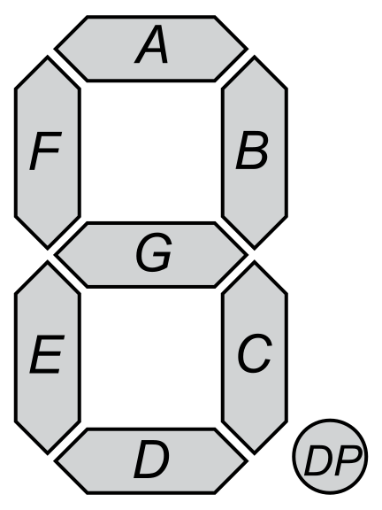

# Preparations

Common Cathode 7-segment display (CC SSD): connected to common cathode, segments light up with HIGH level (1).
Common Anode 7-segment display (CA SSD): connected to common cathode, segments light up with LOW level (0).

| **Digit** | **A** | **B** | **C** | **D** | **E** | **F** | **G** | **DP** |
| :-: | :-: | :-: | :-: | :-: | :-: | :-: | :-: | :-: |
| 0 | 0 | 0 | 0 | 0 | 0 | 0 | 1 | 1 |
| 1 | 1 | 0 | 0 | 1 | 1 | 1 | 1 | 1 |
| 2 | 0 | 0 | 1 | 0 | 0 | 1 | 0 | 1 |
| 3 | 0 | 0 | 0 | 0 | 1 | 1 | 0 | 1 |
| 4 | 1 | 0 | 0 | 1 | 1 | 0 | 0 | 1 |
| 5 | 0 | 1 | 0 | 0 | 1 | 0 | 0 | 1 |
| 6 | 0 | 1 | 0 | 0 | 0 | 0 | 0 | 1 |
| 7 | 0 | 0 | 0 | 1 | 1 | 1 | 1 | 1 |
| 8 | 0 | 0 | 0 | 0 | 0 | 0 | 0 | 1 |
| 9 | 0 | 0 | 0 | 0 | 1 | 0 | 0 | 1 |

Connection of seven-segment display: PB0[8] - data input | PD7[~7] - Clock | PD4[4] - Latch.

Shift registry 74HC595 slouží k tomu, aby bylo možné ze sériové komunikace poslat paralelně všechny data o jednotlivých pinech naráz. (Aby se číslo zobrazilo naráz a ne postupně).

Snake look-up table:

| **Position** | **A** | **B** | **C** | **D** | **E** | **F** | **G** | **DP** | **SEG** | **Position** |
| :-: | :-: | :-: | :-: | :-: | :-: | :-: | :-: | :-: | :-:| :-: |
| 0 | 0 | 1 | 1 | 1 | 1 | 1 | 1 | 1 | A | Top |
| 1 | 1 | 0 | 1 | 1 | 1 | 1 | 1 | 1 | B | Right - higher |
| 2 | 1 | 1 | 0 | 1 | 1 | 1 | 1 | 1 | C | Right - lower |
| 3 | 1 | 1 | 1 | 0 | 1 | 1 | 1 | 1 | D | Bottom |
| 4 | 1 | 1 | 1 | 1 | 0 | 1 | 1 | 1 | E | Left - lower |
| 5 | 1 | 1 | 1 | 1 | 1 | 0 | 1 | 1 | F | Left - higher |

